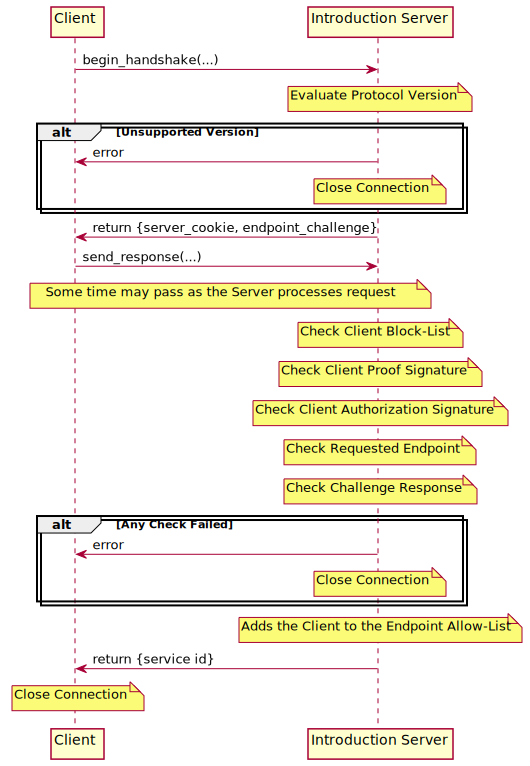
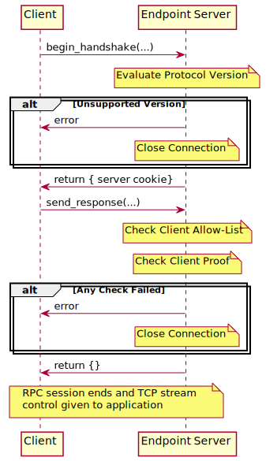

# Gosling Protocol v0.0.1

The Gosling protocol allows for the creation of onion-service based peer-to-peer (onion-to-onion) applications. Initial inspiration came from the Ricochet instant messenger's peer-to-peer onion service architecture. Improvements have been made and some privacy issues have been addressed and fixed.

The purpose of Gosling is to standardize a privacy-preserving architecture for peer-to-peer applications on the Tor network between **nodes**.

- **Node** - A peer in a service-specific Gosling peer-to-peer network.

Each node has three components: a **client**, an **introduction server**, and a set of at least one **endpoint server**. A node can simultaneously have all three components running at the same time, or each component could be split across multiple real computers on the tor network. A node is primarily identified by the onion-service id of its introduction server.

- **Client**  - A node's component making an outgoing connection to another node
- **Introduction Server** - A node's onion-service which listens for requests coming from clients who have never connected before that wish to become 'friends'. The introduction server and a client perform a handshake and exchange information required to reach the introduction server's endpoint server(s)[^1]. An introduction server may serve as the introduction server for mutltiple endpoint applications.
- **Endpoint Server** - A node's onion-service(s) which listen for connections coming from authenticated clients. The route to this server is protected with tor client authentication[^2]. A node may have multiple simultaneous endpoint servers (each with a different onion-service id), as tor only supports a finite number of authenticated clients per onion service.

Nodes communicate with each other using a BSON-based RPC protocol[^3]. After a client connects and successfully authenticates with an endpoint server, we exit the Gosling handshake state machine and control over the RPC session is handed over to the endpoint's application. The endpoint application may then optionally end the RPC session and communicate over the underlying TCP socket directly.

# Gosling Handshakes

All types used in these RPC calls are BSON[^4] types.

## Introduction

### Sequence Diagram



The client may optionally add the introduction server's onion service id to its own allow list to short-cut the friend request when client/server roles are reversed.

### Introduction Server RPC API

```c++
namespace gosling_introduction {
  // Starts an introduction handshake session
  //
  // params:
  // - string version: the requested version of the Gosling protocol to use
  // - string client_identity: the client's v3 onion service id
  //
  // return: a document object with the following members on success, otherwise
  // an error is raised
  // - binary server_cookie: 32 byte cookie randomly generated by the server
  begin_handshake(string version,
                  string client_identity) -> document

  // Submits the client proof to the server for verification. If this function
  // is called before the handshake has begun, an error is raised.
  //
  // parameters:
  // - binary client_cookie: 32 byte cookie randomly generated by the client
  // - binary client_proof: 64 byte ed25519 proof signature
  //
  // return: an empty document on success, otherwise an error is raised.
  send_client_proof(binary client_cookie,
                    binary client_proof) -> document;

  // Request the v3 onion service id of a given endpoint service. If this
  // function is called before the client is authorized, an error is raised.
  //
  // parameters:
  // - string endpoint: the application endpoint we wish to access
  // - document request_blob: an endpoint-specific object for the introduction
  //   server to evaluate
  // - binary client_authentication_key: a 32-byte x25519 public key used to encrypt
  //   the onion service descriptor
  //
  // return: a document object with the following members on success, otherwise
  // an error is raised
  // - string endpoint_onion: the v3 onion service id of the endpoint server;
  //   the endpoint's onion service descriptor will be encrypted with the
  //   client's provided client authentication key
  request_endpoint(string endpoint,
                   document request_blob,
                   binary client_authenticatation_key) -> document;
}
```

## Endpoint

### Sequence Diagram



### Endpoint Server RPC API

```c++
namespace gosling_endpoint {
  // Starts an endpoint handshake session
  //
  // params:
  // - string version: the requested version of the Gosling protocol to use
  // - string client_identity: the client's v3 onion service id
  //
  // return: a document object with the following members on success, otherwise
  // an error is raised
  // - binary server_cookie: 32 byte cookie randomly generated by the server
  begin_handshake(string version,
                  string client_identity) -> document

  // Submits the client proof to the server for verification.
  //
  // parameters:
  // - binary client_cookie: 32 byte cookie randomly generated by the client
  // - binary client_proof: 64 byte e25519 proof signature
  //
  // return: an empty document on success, otherwise an error is raised
  send_client_proof(binary client_cookie,
                    binary client_proof) -> document;

  // Opens an endpoint session on this connection with the given channel
  // name. If the client already has an open endpoint session with the
  // given channel name, the existing session is terminated.
  open_endpoint(string endpoint, string channel) -> document;
}
```

## Proof Calculation and Verification

The proof signed by client is calculated as:

```
proof = SHA256(domain_separator +
               client_onion_id  +
               server_onion_id  +
               client_cookie    +
               server_cookie)
```

The **'+'** operator here indicates concatenation. The parameters are defined as:

- **domain_separator** : an ASCII string (without a null terminator); for the introduction handshake, this string is "gosling-introduction"; for the endpoint handshake, this string is "gosling-endpoint"
- **client_onion_id** : an ASCII string (without a null terminator); the base-32 encoded onion service id (without the ".onion" suffix) of the connecting client's introduction server
- **server_onion_id** : an ASCII string (without a null terminator); the base-32 encoded onion service id (without the ".onion" suffix) of the connected server (ie: when connected to the introduction server, the introduction server's onion service id is used; when connected to an endpoint server, that endpoint server's onion service id is used)
- **client_cookie** : cryptographically-randomly generated 32 byte client cookie
- **server_cookie** : cryptographically-randomly generated 32 byte server cookie

A client authenticates itself to a gosling server (both introduction or endpoint) by signing the above proof with the associated ed25519 private key of its own introduction server.

---

[^1]: in practice either node may or may not have endpoint servers running

[^2]: onion service client authentication: https://community.torproject.org/onion-services/advanced/client-auth/

[^3]: see [rpc.md](./rpc.md)

[^4]: see [BSON spec](https://bsonspec.org/spec.html)
